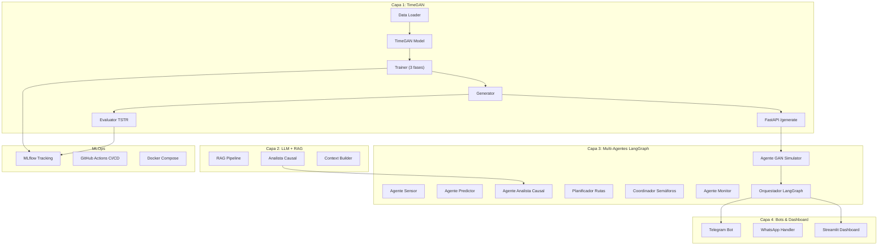
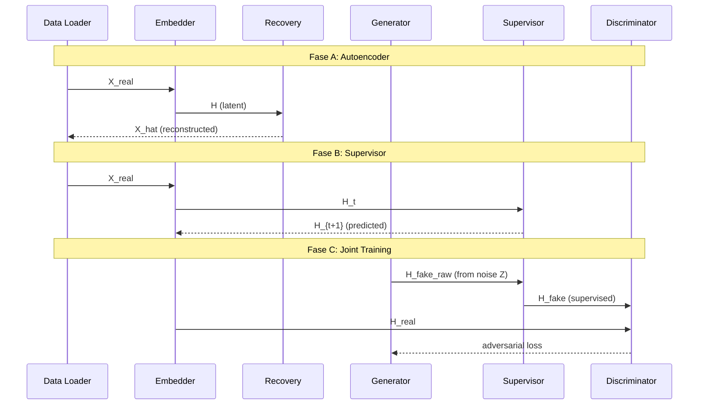

# Arquitectura del Sistema — TransitMind Sogamoso

## Diagrama General

```mermaid
graph TB
    subgraph "Capa 1: TimeGAN"
        DL["Data Loader"] --> TM["TimeGAN Model"]
        TM --> TR["Trainer (3 fases)"]
        TR --> GEN["Generator"]
        GEN --> EVAL["Evaluator TSTR"]
        GEN --> API["FastAPI /generate"]
    end

    subgraph "Capa 2: LLM + RAG"
        RAG["RAG Pipeline"]
        CA["Analista Causal"]
        CB["Context Builder"]
    end

    subgraph "Capa 3: Multi-Agentes LangGraph"
        AS["Agente Sensor"]
        AP["Agente Predictor"]
        AGS["Agente GAN Simulator"]
        ACA["Agente Analista Causal"]
        ARP["Planificador Rutas"]
        ATC["Coordinador Semáforos"]
        AM["Agente Monitor"]
        ORCH["Orquestador LangGraph"]
    end

    subgraph "Capa 4: Bots & Dashboard"
        TB["Telegram Bot"]
        WA["WhatsApp Handler"]
        DASH["Streamlit Dashboard"]
    end

    API --> AGS
    AGS --> ORCH
    CA --> ACA
    ORCH --> DASH
    ORCH --> TB

    subgraph "MLOps"
        MLF["MLflow Tracking"]
        GHA["GitHub Actions CI/CD"]
        DOC["Docker Compose"]
    end

    TR --> MLF
    EVAL --> MLF
```

## Flujo de Datos TimeGAN

```mermaid
sequenceDiagram
    participant DL as Data Loader
    participant E as Embedder
    participant R as Recovery
    participant G as Generator
    participant S as Supervisor
    participant D as Discriminator

    Note over DL,D: Fase A: Autoencoder
    DL->>E: X_real
    E->>R: H (latent)
    R-->>DL: X_hat (reconstructed)

    Note over DL,D: Fase B: Supervisor
    DL->>E: X_real
    E->>S: H_t
    S-->>E: H_{t+1} (predicted)

    Note over DL,D: Fase C: Joint Training
    G->>S: H_fake_raw (from noise Z)
    S->>D: H_fake (supervised)
    E->>D: H_real
    D-->>G: adversarial loss
```
